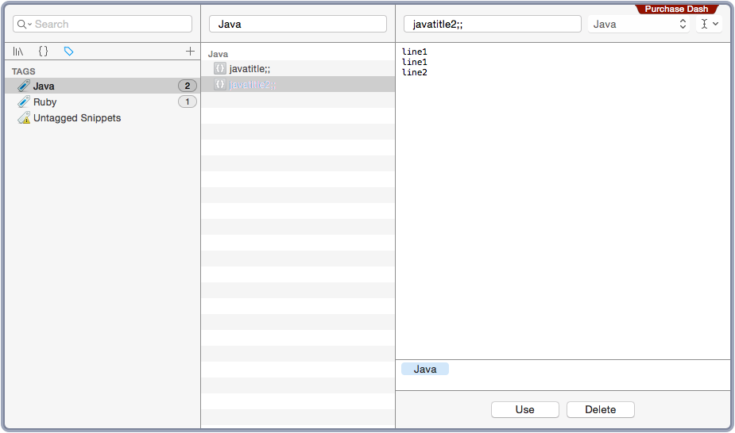

Dash Snippet Builder

## Setup
```
$ git clone https://github.com/tbpgr/dash_snippets_builder.git
```

## Structure
java1.toml, java2.toml, ruby1.toml are sample snippets.

```
.
├── Gemfile
├── Gemfile.lock
├── LICENSE.txt
├── README.md
├── Rakefile
└── snippets : you save snippets here
    ├── java
    │   ├── java1.toml
    │   └── java2.toml
    └── ruby
        └── ruby1.toml
```

## Settings
### Move to work dir
```
$ cd %git%/dash_snippets_builder

# check rake task
$ rake -T
rake dash:build  # build snippets
```

### .env Setting(Sample)
```
$ cd 
$ touch .env
```

```
DASH_SNIPPET_PATH=/Users/your user name/Library/Application Support/Dash/library.dash
LOG_LEVEL=DEBUG
```

### TOML Setting(Samples)
* snippets/java/java1.toml

```
[snippet]
title = "javatitle;;"
body = "line1\nline1\nline2\n"
syntax = "Java"
tag = "Java"
```

* snippets/java/java2.toml

```
[snippet]
title = "javatitle2;;"
body = "line1\nline1\nline2\n"
syntax = "Java"
tag = "Java"
```

* snippets/ruby/ruby1.toml

```
[snippet]
title = "title;;"
body = "line1\nline1\nline2\n"
syntax = "Ruby"
tag = "Ruby"
```

## Usage
### Build
```bash
$ rake dash:build
2015/12/15 22:35:40 - DEBUG - start build snippets
2015/12/15 22:35:40 - DEBUG -  start delete snippets
2015/12/15 22:35:40 - DEBUG -    success delete snippets
2015/12/15 22:35:40 - DEBUG -    success delete tagsIndex
2015/12/15 22:35:40 - DEBUG -    success delete tags
2015/12/15 22:35:40 - DEBUG -  finish delete snippets
2015/12/15 22:35:40 - DEBUG -  create javatitle;;
2015/12/15 22:35:40 - DEBUG -    insert tagsIndex for title:javatitle;; tag: Java
2015/12/15 22:35:40 - DEBUG -    create tag Java
2015/12/15 22:35:40 - DEBUG -    create snippet javatitle;;
2015/12/15 22:35:40 - DEBUG -  create javatitle2;;
2015/12/15 22:35:40 - DEBUG -    insert tagsIndex for title:javatitle2;; tag: Java
2015/12/15 22:35:40 - DEBUG -    create snippet javatitle2;;
2015/12/15 22:35:40 - DEBUG -  create title;;
2015/12/15 22:35:40 - DEBUG -    insert tagsIndex for title:title;; tag: Ruby
2015/12/15 22:35:40 - DEBUG -    create tag Ruby
2015/12/15 22:35:40 - DEBUG -    create snippet ti
```

### Check SQLite Table
```bash
$ cd ~/Library/Application Support/Dash
$ sqlite3 library.dash
sqlite> select * from snippets;
1|javatitle;;|line1
line1
line2
|Java|0
2|javatitle2;;|line1
line1
line2
|Java|0
3|title;;|line1
line1
line2
|Ruby|0
sqlite> select * from tags;
1|Java
2|Ruby
sqlite> select * from tagsIndex;
1|1
1|2
```

### Dump
```bash
$ rake dash:dump
2015/12/15 23:32:38 - DEBUG - start dump snippets
2015/12/15 23:32:38 - DEBUG -   snippet count = 3
2015/12/15 23:32:38 - DEBUG -    complete output ./snippets/dump/javatitle.toml
2015/12/15 23:32:38 - DEBUG -    complete output ./snippets/dump/javatitle2.toml
2015/12/15 23:32:38 - DEBUG -    complete output ./snippets/dump/title.toml
2015/12/15 23:32:38 - DEBUG - finish dump snippets
```

```bash
$ cd  snippets/dump
$ cat *.toml
[snippet]
body = "line1\nline1\nline2\n"
syntax = "Java"
tag = "Java"
title = "javatitle;;"
[snippet]
body = "line1\nline1\nline2\n"
syntax = "Java"
tag = "Java"
title = "javatitle2;;"
[snippet]
body = "line1\nline1\nline2\n"
syntax = "Ruby"
tag = "Ruby"
```

## After build

